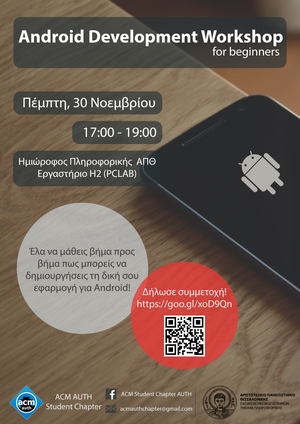

Την Πέμπτη 30/11, στις 17.00, θα πραγματοποιηθεί workshop από μέλη του ACM AUTh Student Chapter με θέμα την ανάπτυξη εφαρμογών για το λειτουργικό σύστημα Android. Το workshop απευθύνεται σε αρχάριους με βασικές γνώσεις προγραμματισμού. Έλα να μάθεις βήμα προς βήμα πως μπορείς να δημιουργήσεις τη δική σου εφαρμογή για Android!

Διάρκεια: ~2 ώρες
Τοποθεσία: Εργαστήριο Υπολογιστών H2 (Πρώην PCLAB), Ημιώροφος Πληροφορικής, Αριστοτέλειο Πανεπιστήμιο ΑΠΘ

Μπορείτε να δηλώσετε ενδιαφέρον συμμετοχής στην φόρμα: https://goo.gl/forms/g3M13gFuIT5lnvYM2

Προτείνεται να έχετε το laptop σας με εγκατεστημένο το Android Studio (https://goo.gl/aepj2S)

## Υλικό

* [Παρουσίαση](../assets/android-development-workshop/android-for-beginners.pptx)
* [Android Project](../assets/android-development-workshop/Todolist.zip)

Facebook [Event Page](https://www.facebook.com/events/115038012523801)

